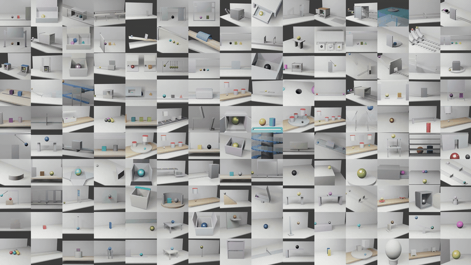

# object-permanence

<p align="center"></p>

Code for the paper **_Training Object Permanence in World Models_**. This codebase contains the data and training infra in the paper. 

```
object-permanence/
├── object_permanence/   Part 1 · data factory: 150 Blender task generators + CLI
├── pwm/                 Part 2 · training stack: Cosmos3-Nano on Trainium2, native PyTorch
├── pyproject.toml       pip package `object-permanence`
└── LICENSE              CC BY-NC 4.0 (Part A) + NVIDIA Cosmos OpenMDW-1.1 (Part B)
```

---

## 1. Data factory

Blender-rendered scenes where objects persist while occluded, packaged as video-to-video samples. 150 self-contained task generators in six cognitively grounded families:

### 1.1 Install

```bash
git clone https://github.com/hokindeng/object-permanence.git
cd object-permanence

pip install -e .
```

### 1.2 Generate

```bash
# List all 150 tasks
object-permanence generate --list

# Generate all tasks (150 x 20 = 3000 samples; --parallel 3 Blender processes by default)
OP_FORCE_EEVEE=1 object-permanence generate --out ./out --per 20 --parallel 4

# Generate a shard (for parallel fleets)
object-permanence generate --gens G01-G11 --per 20

# Part of one task — samples 200..299 only
object-permanence generate --task G18 --per 100 --start 200

# Single task, fast preview (360p; audit it with --allow-preview)
object-permanence generate --task G18 --per 20 --preview 1

# Standard-resolution, frame-continuous preview for collision-boundary QA
object-permanence generate --task G120 --per 3 --preview 1 --preview-frame-step 1

# Keep only the previous appearance-level variation
object-permanence generate --task G18 --per 20 --diversity-profile surface
```

### 1.3 Output format

Each sample is a five-file V2V set:

```
<out>/turntable_behind_screen_task/turntable_behind_screen_0000/          # task G18
├── input_video.mp4      # Simulation up to the split point (model conditioning input)
├── target_video.mp4     # Simulation after the split point (reference output)
├── prompt.txt           # Continuation instruction: what the target clip shows
├── trajectory.npz       # Per-frame ground truth for every body
└── metadata.json        # Parameters, provenance, video split
```

---

## 2. Training stack

A native-PyTorch implementation of NVIDIA Cosmos3-Nano for AWS Trainium2: it loads the public diffusers-layout weights and trains and samples on Neuron without XLA graph tracing. Tensor parallel × FSDP2 over 64 NeuronCores on a trn2.48xlarge.

From the repository root on a trn2 box:

```bash
export PWM_IMAGE=<neuron native-pytorch container image@digest>
bash pwm/launch.sh pip pwm            # container "pwm" + deps
bash pwm/launch.sh preflight          # read-only checks: driver, devices, image, cache, weights, box idle
```

**Encode** — This will prepare the vectors for training. 

```bash
bash pwm/launch.sh pwm -- sh -c 'python -m pwm.data.from_object_permanence /out/renders > /out/rows.jsonl'
bash pwm/launch.sh pwm -- python -m pwm.cli encode --manifest /out/rows.jsonl \
    --out /out/data/clips_320x192_t30 --ckpt /weights/Cosmos3-Nano --latent-t 30 --height 192 --width 320 --text-len 128
```

**Train** the paper recipe for training.

```bash
bash pwm/launch.sh pwm -- python -m pwm.cli train /repo/pwm/configs/wrop.yaml
bash pwm/launch.sh pwm -- python -m pwm.cli bench /repo/pwm/configs/example.yaml --warmup 3 --steps 20
```

---

## License

CC BY-NC 4.0 — Copyright (c) 2026 Hokin Deng <hokinxqdeng@gmail.com>. Non-commercial research use with attribution; contact the author for commercial licensing.

## Citation

```bibtex
@article{zhang2026training,
  title   = {Training Object Permanence in World Models},
  author  = {Zhang, Haotian and others},
  year    = {2026},
  url     = {https://object-permanence.world}
}
```
