# pwm — Cosmos3-Nano on AWS Trainium2

A native-PyTorch implementation of Cosmos3-Nano for AWS Trainium2: it loads the public weights (or the released
PWM-WROP fine-tune) and trains and samples on Neuron. `configs/wrop.yaml` is the PWM-WROP recipe of the paper;
`configs/example.yaml` is the 288×512 text-to-video geometry the throughput numbers below were measured at.

## 1. Machine

One trn2 instance (trn2.3xlarge for inference and small experiments, trn2.48xlarge for 36-layer training) running
a Neuron DLAMI with Docker. You need a Neuron Deep Learning Container whose PyTorch runs natively on Trainium
(`torch_neuronx` ≥ 2.11.3 with `device="neuron"` and `torch.compile(backend="neuron")`). pwm was developed on a
pre-release build of that runtime from the AWS Neuron team; ask them for the image or use the public release once
it ships, pull it by digest, and export the pinned reference as `PWM_IMAGE`. Pin the host driver to the version
the runtime expects, download the weights, then create the container and check the host:

```bash
git clone https://github.com/hokindeng/object-permanence && cd object-permanence
export PWM_IMAGE=<registry>/<image>@sha256:<digest>
sudo apt-get install -y --allow-downgrades --allow-change-held-packages aws-neuronx-dkms=2.28.0.0 && sudo apt-mark hold aws-neuronx-dkms   # reboot if the version changed
huggingface-cli download nvidia/Cosmos3-Nano --local-dir ~/weights/Cosmos3-Nano   # transformer/ (7 shards), vae/, text_tokenizer/
huggingface-cli download Hokin/PWM-WROP --local-dir ~/weights/PWM-WROP             # optional: the released fine-tune, for sampling
bash pwm/launch.sh pip pwm          # create container "pwm" from $PWM_IMAGE and install the pwm dependencies
bash pwm/launch.sh preflight        # read-only checks: driver, devices, image, cache, weights, box idle
```

`DKMS_REQUIRED` (default 2.28.0.0) is the driver version `preflight` insists on; override it to match your
runtime. Host paths mounted into the container (overridable by environment variables): `$HOME/weights` →
`/weights`, `$HOME/out` → `/out`, `$HOME/neff_cache` → `/neff_cache`, this repository → `/repo`.
`bash pwm/launch.sh pwm -- <cmd>` runs `<cmd>` inside the container and tees the log to `~/out/pwm/<UTC>.log`;
`DETACH=1` runs it in the background.

## 2. Data

Encode (video, caption) rows into fixed-shape clips, once, on CPU. The manifest and the videos must live under
`~/out` so the container can see them. Renders from the data factory (Part 1 of the root README) become a
manifest with one command:

```bash
# renders under ~/out/renders on the host = /out/renders in the container; paths in the manifest are container paths
bash pwm/launch.sh pwm -- sh -c 'python -m pwm.data.from_object_permanence /out/renders > /out/rows.jsonl'
# rows.jsonl: {"id": ..., "videos": [input_video.mp4, target_video.mp4], "caption": <prompt.txt>, "fps": 24.0,
#              "skip_frames": <input frames - 57>, "cond_latent_frames": 15}
#   -> the last 57 input frames are the clean prefix, the first 60 target frames are predicted (117 frames = latent_t 30)
# Any (video, caption) rows work: {"id": ..., "video": "/out/videos/clip.mp4", "caption": "..."} (t2v),
#   optional "fps", "native_fps" (resample), "skip_frames", "cond_latent_frames".
bash pwm/launch.sh pwm -- python -m pwm.cli encode --manifest /out/rows.jsonl \
    --out /out/data/clips_320x192_t30 --ckpt /weights/Cosmos3-Nano --latent-t 30 --height 192 --width 320 --text-len 128
```

`data.clips_dir` in the YAML is this output directory (`wrop.yaml` defaults to `/out/data/clips_320x192_t30`).
Before a large run, scan the clip files themselves (zip structure, CRC, `torch.load`):
`python -m pwm.data.preflight_scan /out/data/clips_320x192_t30 [--procs 32]` exits 1 on any bad file and writes
the list to `<clips_dir>/.preflight_bad.txt` (one corrupt row in a million-row corpus only surfaces when the
sampler draws it). A source shorter than the geometry needs (`--latent-t 30` reads 117 frames, plus
`skip_frames`) is rejected, never padded; a container frame rate that differs from `--fps` is rejected unless
the row declares `native_fps` (then it is resampled).

## 3. Training

Parallel degrees live only in the YAML's `parallel:` block (`tp`, `fsdp`); the CLI relaunches itself under
torchrun with `tp*fsdp` processes. `configs/wrop.yaml` is the paper recipe (36 layers, tp4×fsdp16 = 64 cores,
320×192, 57 + 60 frames, one epoch over 1.5M samples at batch 16); every key is commented. Copy it and change
what you need.

```bash
bash pwm/launch.sh pwm -- python -m pwm.cli train /repo/pwm/configs/wrop.yaml
# step time only:
bash pwm/launch.sh pwm -- python -m pwm.cli bench /repo/pwm/configs/example.yaml --warmup 3 --steps 20
```

Checkpoints are written per rank under the YAML's `training.ckpt_dir`; a rerun resumes from the last complete
step.

Everything that can go wrong is rejected before step one; there are no silent defaults. The YAML is
type-checked and validated at load (enums, positive degrees, `tp` dividing the head count, geometry that is a
whole number of patches); `train`/`infer` refuse an empty `checkpoint_dir` (only `bench` builds a random-init
model, and says so); `train` refuses `fsdp: 1` with a bf16 model (no fp32 master copy); a torchrun world that
does not equal `tp × fsdp` is an error, not an override; at start every clip in `clips_dir` is checked against
the YAML's `data:` geometry; a resume whose config differs from the checkpoint's (paths, save/log frequency and
performance switches excepted) is refused; before the first step `ckpt_dir` is checked for room for every
checkpoint of the run (a 36-layer save across all ranks is about 162 GiB, and nothing is ever deleted).
The only gate that stops a run in flight: `training.skip_step_abort_after` consecutive steps (default 50,
`null` disables) refused by the skip guard (gradient norm > `skip_step_grad_norm` or non-finite) count as
divergence — a checkpoint is saved, then `RuntimeError`, instead of skipping the remaining thousands of steps
(on a sibling model this caught a 2e-4 explosion at step 705 instead of idling all night). The clipping norm is
MAX-reduced over the whole world before use, so every rank applies the same coefficient; `gnorm_spread` in
each step's log is max−min of the ranks' pre-clip norms (normally 0 or 1e-6).
`parallel.reshard_after_forward_blocks: N` applies `reshard_after_forward: false` to the first N blocks only
(the rest, the island and the root keep the default), so the HBM-for-time trade can be dialled instead of
all-or-nothing (see Performance notes).
Runtime switches outside the YAML: `PWM_MEM_LOG=1` logs device memory per phase (adds syncs; off when
timing), `PWM_FSDP_COPYIN=chunk_cat` falls back to torch's own reduce-scatter copy-in, `PWM_PG_TIMEOUT_S` sets
the process-group timeout (`launch.sh` sets 6 hours), `PWM_FLAT_CHUNK` is the chunk size in elements for
`optimizer_mode: flat` (default 32M).

## 4. Sampling

`infer` runs on `tp` ranks only (`fsdp` is ignored) and loads the model in `model.dtype`: 36 layers in bf16 is
29 GB, 7.3 GB per core on a trn2.3xlarge (4 cores), the same on a 48xl; the production YAML works as is.
`--weights` (or `weights_dir` in the YAML) points at a directory of transformer weights to load instead of the
base — the released `Hokin/PWM-WROP` download works directly (its flat `model-*.safetensors` layout is renamed on
the fly by `model/convert.py`); `checkpoint_dir` still supplies `vae/` and `text_tokenizer/`.

```bash
bash pwm/launch.sh pwm -- python -m pwm.cli infer /repo/pwm/configs/wrop.yaml --weights /weights/PWM-WROP \
    --v2v /out/data/clips_320x192_t30/<id>.pt --prompt "..." --out /out/sample.mp4
# t2v with the base weights: drop --weights and --v2v, use configs/example.yaml
```

The prompt is padded to the training `data.text_len` (padding keeps its positions but is hidden from the
vision tokens), so every prompt compiles to the one training shape; a prompt longer than `text_len` is
rejected. Padding needs `model.attention_backend: sdpa` (the NKI path's contiguous bounds cannot mask the
middle of a sequence).

## 5. Exporting a trained checkpoint to the diffusers layout

```bash
bash pwm/launch.sh pwm -- python -m pwm.cli consolidate /repo/pwm/configs/wrop.yaml \
    --step 93750 --out /out/PWM-WROP-step93750 --dtype bf16
```

The shards carry the training config; `consolidate` refuses a YAML whose `tp`/`fsdp`/`layers` differ, and
every assembled tensor must match the base checkpoint's shape.

## Performance notes

- **foreach AdamW + FSDP2 prefetch (36 layers tp4×fsdp16, 64-rank A/B, `bench --warmup 3 --steps 10`):
  6.84 → 5.71 s/step (−16.5%), 10,404 → 12,454 tok/s, losses equal to 4 digits step by step.**
  `training.optimizer_mode: foreach` replaces the chunk-synchronised single-tensor AdamW (about 10 kernel
  launches and 22 syncs per parameter) with multi-tensor kernels and one sync per step; DTensor and plain
  parameters are grouped separately. `parallel.fsdp_{forward,backward}_prefetch: 2` issues the next blocks'
  all-gathers early. Both are set in the YAMLs; the code defaults stay `chunk_sync` / 0. The single-core
  micro-benchmark behind the switch: 126 ms versus 1,324 ms per optimizer step on a rank holding 662 tensors.
  The compiled MoTBlock itself has no degraded operators (per-operator compile checked against eager, bwd/fwd
  1.8).

- **First 24 blocks resident between forward and backward (`reshard_after_forward: false` +
  `reshard_after_forward_blocks: 24`), 64-rank interleaved A/B, `bench --warmup 3 --steps 20`: 5.69 → 5.20
  s/step (−8.6%), losses equal to 5 digits (the multi-tensor clipping kernel changes the summation order).
  Peak 13.1 GiB/rank; all 36 resident OOMs at the first clip (allocated peak 14.6 GiB, but the NRT pool had
  20.5 GiB reserved), hence the dial. The same round added `optimizer_mode: flat` (AdamW on one padded flat fp32
  buffer per group): 5.31 versus foreach's 5.20 s/step, **slower** (pwm has few tensors per rank; the copies
  outweigh the launches saved), kept opt-in and not used. Also from that round: the clipping norm MAX-reduced
  over the whole world (previously each tp position reduced within its own dp group only, relying on the
  rounding consistency of `sync_tp_replicated_grads`), the `gnorm_spread` observation, the consecutive-skip
  abort gate and `pwm.data.preflight_scan`.**

## Architecture diagrams

Every diagram below is derived from the code (module, function and file names are real identifiers); the files
it rests on are named under each heading.

### 1. Directory and package structure

From `git ls-files`. Six sub-packages plus a CLI and a host script; every library module carries a
hardware-free `__main__` self-check.

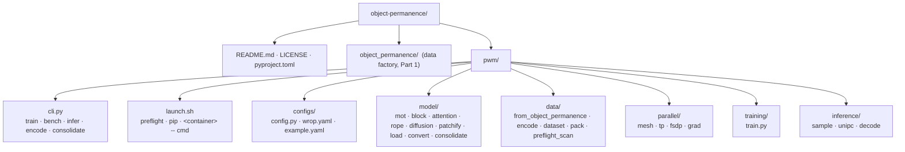

### 2. Module import dependencies

From an `ast` scan of every `from pwm... import` (including lazy imports inside functions). `configs.config` is
imported by almost every module; edges to it are omitted for clarity. `cli` is the only composition root;
`data.encode` depends on `inference.decode` for the VAE, the one "upward" edge.

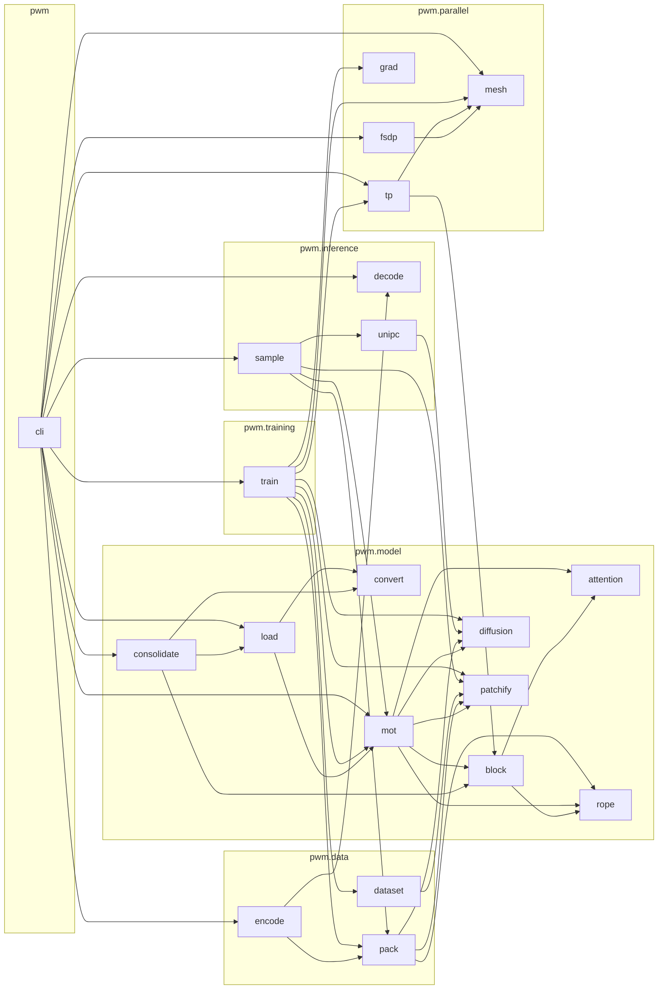

### 3. Entry point: the CLI and the torchrun relaunch

From `main`, `_maybe_relaunch` and `_under_torchrun` in `pwm/cli.py`. The config is validated once before the
relaunch; `encode` and `consolidate` are single-process CPU commands that never go through torchrun.

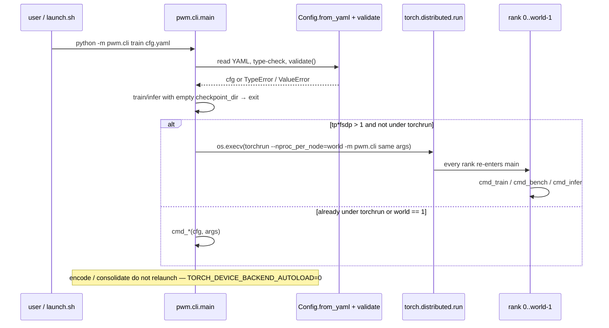

### 4. `build_model`: from a meta model to a runnable sharded model

From `pwm/cli.py::build_model`, `pwm/parallel/{mesh,tp,fsdp}.py` and `pwm/model/load.py`. With FSDP the weights
are streamed one unit at a time (load one block's TP shard → `fully_shard` → next), so the whole unsharded model
never exists on a device.

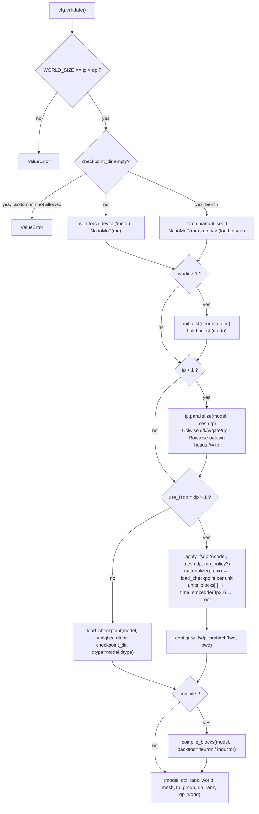

### 5. One training step

From `fit` and `training_step` in `pwm/training/train.py`, `pwm/data/pack.py::pack` and
`pwm/parallel/{tp,grad}.py`. Both "is it finite" and "skip this step" are decided after a world-wide MIN, so
every rank executes the same collectives.

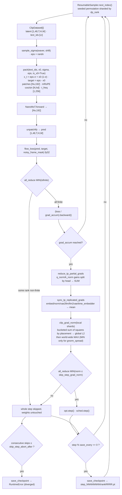

### 6. Data encoding: mp4 → clip.pt

From `pwm/data/encode.py`, `pwm/data/pack.py::text_ids_and_valid` and `pwm/inference/decode.py::load_vae`. Every clip
has one static shape; too few frames or a wrong frame rate are errors. A caption shorter than `text_len` is padded
and the clip records `text_valid` (the pads are hidden from the vision rows, as at inference); a longer one is trimmed.

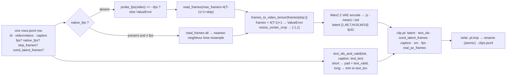

### 7. Sequence layout and two-way attention

From `pwm/model/attention.py` (module docstring, `sdpa_two_way`, `pad_key_mask`) and
`pwm/data/pack.py::build_positions`. Text rows attend to text only, causally; vision rows attend to all N keys;
padding keys of a short caption or prompt are hidden from the vision rows by `key_mask` (`where(mask, -inf)`), which the NKI path cannot
express and therefore rejects.

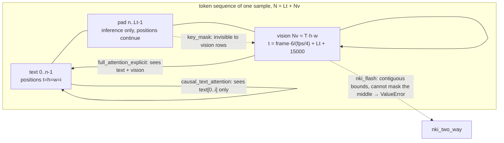

### 8. Model structure `NanoMoT`

From `pwm/model/mot.py` and `pwm/model/block.py`. Each layer is two towers (`und` for text, `gen` for vision)
sharing one two-way attention; `time_embedder` is an fp32 island, everything else follows `model.dtype`.

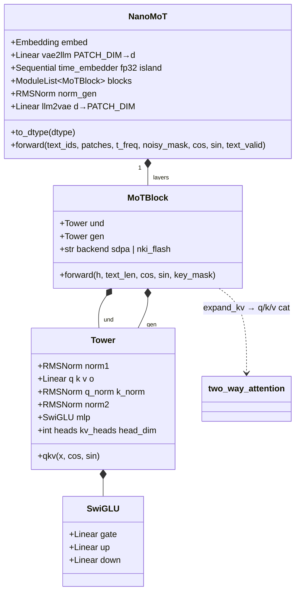

### 9. Parallel topology: mesh, TP sharding, FSDP units

From `pwm/parallel/mesh.py` (`rank = dp_idx * tp + tp_idx`), `pwm/parallel/tp.py` (`COLWISE/ROWWISE`, the three
parameter classes) and `pwm/parallel/fsdp.py::apply_fsdp2`. Production is tp4×fsdp16 = 64 ranks.

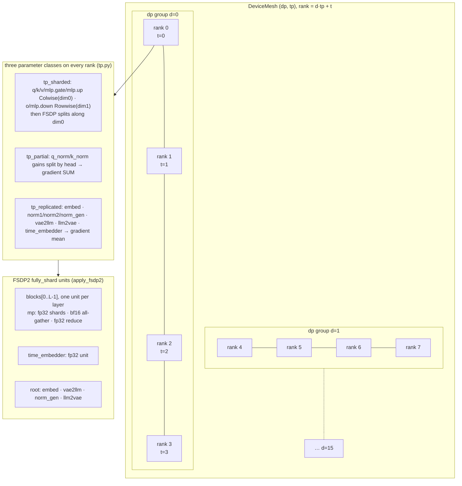

### 10. Checkpoint lifecycle

From `save_checkpoint`, `latest_step`, `load_checkpoint_dir`, `check_resume_cfg` and `check_ckpt_disk` in
`pwm/training/train.py`, and `pwm/model/consolidate.py::consolidate_dir`.

```mermaid
stateDiagram-v2
  [*] --> PreRunChecks
  PreRunChecks --> Training : check_ckpt_disk passes; ckpt_dir holds only step_NNNNNNNN/ and metrics.jsonl
  PreRunChecks --> [*] : not enough disk / stray files in the directory → error
  Training --> WritingShards : step % save_every == 0
  WritingShards --> OnDisk : every rank torch.save → .pt.tmp → rename
  OnDisk --> Complete : after the barrier rank 0 writes COMPLETE(step, world)
  Complete --> Training
  Training --> [*] : max_steps
  state Resume {
    [*] --> FindLatest
    FindLatest --> CompareConfig : check_resume_cfg(saved cfg, cfg)
    CompareConfig --> Load : only path / frequency / performance keys differ
    CompareConfig --> Refuse : any other key differs → ValueError
    Load --> [*] : model · opt(_relift DTensor) · sched · sampler · rng · gen
  }
  Complete --> Resume : fit again; latest_step = highest step with COMPLETE
  Complete --> Export : consolidate_dir(step_dir)
  Export --> DiffusersLayout : check the shards' cfg.parallel/layers and COMPLETE.world, assemble, shapes == base → safetensors
```

### 11. Inference: UniPC sampling

From `pwm/cli.py::cmd_infer`, `pwm/inference/sample.py`, `pwm/inference/unipc.py::FlowUniPC` and
`pwm/inference/decode.py`. The solver runs on CPU in fp32; two forwards per step with CFG.

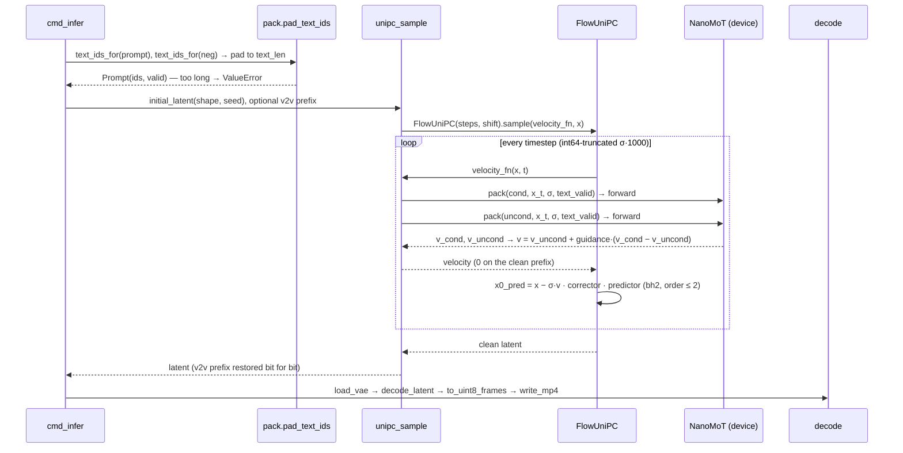

### 12. Config schema

From `pwm/configs/config.py`. A YAML is a partial override of the defaults: unknown keys, wrong types and
illegal values fail at load. Constants that no run changes (48 latent channels, patch 2, 256-wide time
embedding) are module constants, not config keys.

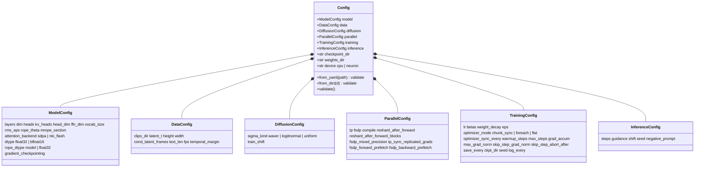

### 13. Failure gates: where the code refuses, and what

From `config.py::validate/_coerce`, `cli.py::main/build_model/cmd_train`, `dataset.py::_scan`,
`train.py::check_*`, `load.py`, `consolidate.py` and `encode.py`. Every gate sits before the first training step.

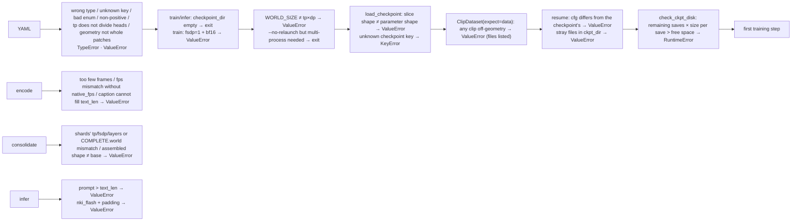

After training starts there is one gate: `skip_step_abort_after` consecutive steps refused by the skip guard →
checkpoint → `RuntimeError` (see §5). On the data side an optional pre-scan, `python -m pwm.data.preflight_scan
<clips_dir>` (§2), runs before that.
